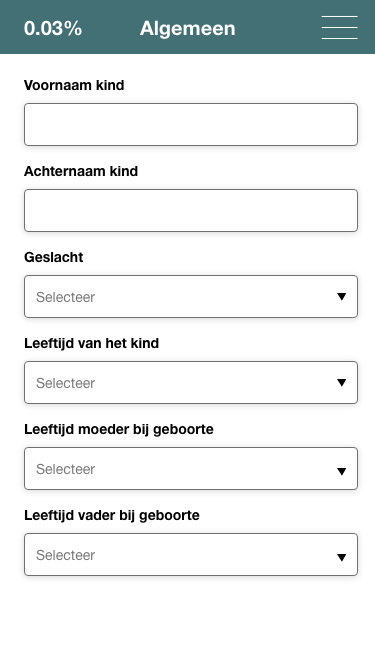

# Risk Indication App

## About

This application is focussed around youth healtcare workers. The main goal of this application is to decrease the amount of young people that need to leave their house as a result of threathening situations in and around the household.

What you can do in this current version, is calculate a risk indication percentage, by filling in input fields about a certain person.
This percentage is immediately calculated when you change something in the application.

As for more features, there are none... Read on to know why that is and what I would like to be added in this application.

## Concept

Here you can find my full concept in images. Most of the concept is, as stated above, not in the current application.

### Healtcare worker login screen

### User selection screen

The healtcare worker has to select the child they are working with at that moment in time. The children which the healtcare worker works with most are shown at the top.

It is important to note that every action the healthcare worker performs gets logged and shown in the logs screen. This is done for accuracy purposes.

For other occassions, like when a receives a new healthcare worker, all the filled in data will be transferred to that healthcare workers account, so he or she does not have to go through the forms again, unless when there would be reason for that.

### Home screen

This is the page the healthcare worker lands on, once they have logged in and selected a child.
Here they can reset all the filled in fields for this child and also export the data in excel or pdf format.

### Form screens

The input fields are located on these screens.
They are seperated by category and do not require the user to press a button to recalculate the risk percentage.
Navigation between these pages can be found in the menu at the top of the screen.

### Indication calculation overview screen

On this screen you can view the way the percentage is calculated.
The form fields are shown by category (tab) and shows a indication of the filled in value from `none` to `extreme`.

## Progress

### Week 1

In the first week I attended four days of full-day-study colleges.

I went to the guest speakers talks, this tuesday, where my boss (Peter Peerdeman from Lifely) was talking about React.

When I had to choose three frameworks, which I would like to learn, I chose:
* Vue
* React
* Polymer.

When the three spokesmen this tuesday spoke about their personal favorite frameworks, I immediately wanted to learn Vue. It looked really fun to learn and since I already know React, I decided to go with that as a first choice.

The next day, me and three others had decided for us that we needed to do Polymer.
This was a big bummer, because I would have liked to learn Vue more.

What also was not great, was the fact that Polymer has terrible docs and barely any community support.
We got the framework to work in about a day, which was not terrible, but understanding still has to be gained.

When I finally got the support talk with Laurens, I knew what the excersise was about.
I decided to make a risk indication application for the healtcare workers, so that they would get an easier job.

In this first week I mainly focussed on getting Polymer to work, which took way longer than expected.
What I finished after week one, was mainly the structure of the application.
I had **routing**, **components**, **views** and and some general content.

What I also did in this week, was mainly figuring out a way in which styling could be seperated from the JS.
Unfortunately, I could not find anything of relevance about this subject, so I decided to give up on that part.

### Week 2

In this week I mainly focussed on getting the application to actually give a risk and save the answers users put into the forms.

This took way more time than expected, because Polymer doesn't just simply have a concept for managing states like, for example, React does have.
What Polymer also lacks, is a well-defined way of passing functions by properties, which caused a lot more trouble.

The way I built all of this **now**, is with a lot of functions, that sit in the *utils* folder.
I did manage to create a new understanding about localStorage and functional programming.
I found myself wanting to write clean code, so I abstracted **a lot** of code into more readable bits and pieces.

The [startup](src/utils/startup.js) file, for example, contains logic that runs once the page is loaded.
What this does (in short), is that the localStorage of a new user gets filled with all values required to run the application.

Existing users are noticed here as well, which causes the localStorage data to be parsed to JSON and then put into variables that can be used by the applications forms.

The bussiness logic for generating the percentage at the top of the screen in real-time can be found [here](src/utils/generatePercentage.js). This function takes the array of factorCombinations, that is found in the users localStorage and loops over the values, inserting them in the function that calculates the percentage.

As for the other utils, they are simply functions that do exactly the same, as their name implies.

The [getLocalStorageValue](src/utils/getLocalstorageValue.js) function simply gets the value for a specific input by that inputs name and it's subclass in the data structure and returns it.

The [setFactorValue](src/utils/setFactorValue.js) function sets the factor value of a specific input to the value that is required, i.e. 0 or the factor.

The [setNewLocalstorageValue](src/utils/setNewLocalstorageValue.js) function is used by the application to set the selected value of an input to the localStorage of a user.

One more note about the [triggerRegenerateEvent](src/utils/triggerRegenerateEvent.js) code.
As you might see this is not normal code... This had to be done in order for the [index](src/index.js) to be notified when a child component two levels down would want the percentage to recalculate.

What I also did this week, was mainly help [Chelsea](https://github.com/chelseadoeleman), Jessie and Linda with their applications, which took up a lot of my time, but was fun to do and learned me understand my own code better, while helping them understand all of the complicated stuff above.

#### The less fun stuff

*If you don't want to hear me rant, skip this!*

Why I did it with the Event API and not something native to Polymer... Polymer does not have great documentation, hence the reason I could not find a way to get this to work (with callbacks for example).

As you might be able to read, I am a little bit frustrated by this so called *framework*.
If they would want to compete as a framework with React, Vue and Angular, they do really need to get their documentation and API straight.

The documentation and answers you find on Google are mainly about older versions of Polymer, which are (like anything Google makes), for some reason really different from the newest version.

Polymer feels like it is a *framework* that is missing a ton of essential features, which causes the user (i.e. me) to get creative, which is in itself not a problem.
However, when there is a deadline, this becomes a major problem.

## What is Missing?

* Linting
* A checked build proces
* TypeScript support
* Seperation of Concerns (structure - styling - interaction)
* Mobile / Tablet modes
* Quite a few factors and inputs, since they aren't available
* A way to keep multiple filled in forms (for example of a specific user) and switch between them
* Some form fields, like location, an image input.

## What would be added in future versions?

Aside from all of the above (if possible), things that would be added would include:

* A page where the user can see at a glance what he or she filled in, and what factor that answer contains. This could bring more understanding at the person that is using the application
* A more thought out routing structure, in order for the user to navigate the application more easily
* User signup
* A better concepting result (for example, better images of the designs)
* Helped person selection menu.
* Exporting data of a person.

## PDX (Polymer Developer Experience)

As mentioned before, Polymer has a poor developer experience.
However, I used the following links to make some sense up about Polymer:

* [Polymer 3 Starter Kit](https://github.com/Polymer/polymer-starter-kit)
* [Polymer 3 Docs](https://www.polymer-project.org/3.0/docs/devguide/feature-overview)

## License

This repository is licensed as [MIT](LICENSE) by [Maikel van Veen](https://github.com/maikxx), 2018.